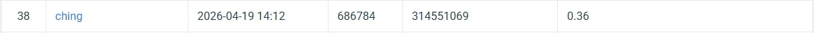

# NYCU Computer Vision 2026 HW2

- **Student ID**: 314551069
- **Name**: KAO YUN CHING

---

## Introduction

This repository contains the implementation for **HW2: Digit Detection** of the NYCU Visual Recognition using Deep Learning course (2026 Spring).

The task is to detect and localize individual digits (0–9) in natural scene images. The model is built on **Deformable DETR** with a **ResNet-50** backbone, extended with the following improvements:

- **Multi-scale feature pyramid** (C3, C4, C5, C6) for detecting digits at various scales
- **Denoising Training (DN)** to accelerate convergence of the Hungarian matching objective
- **Focal Loss** to handle foreground/background class imbalance
- **Mosaic Augmentation** to increase digit instance density per training step
- **Soft-NMS** postprocessing to retain closely spaced digit predictions
- **EMA (Exponential Moving Average)** of model weights for stable evaluation

**Best validation mAP**: `0.468` (COCO @[.5:.95]) at epoch 13

---

## Environment Setup

### Requirements

- Python 3.9+
- PyTorch 2.0+
- CUDA 11.8+

### Installation

```bash
conda create -n dl_vision python=3.10
conda activate dl_vision
pip install torch torchvision --index-url https://download.pytorch.org/whl/cu118
pip install -r requirements.txt
```

### requirements.txt

```
albumentations
matplotlib
numpy
Pillow
scipy
tqdm
pycocotools
scikit-learn
```

### Dataset Structure

```
nycu-hw2-data/
├── train/          # Training images
├── valid/          # Validation images
├── test/           # Test images
├── train.json      # Training annotations (COCO format)
└── valid.json      # Validation annotations (COCO format)
```

---

## Usage

### Training

```bash
python train.py \
    --do_train \
    --train_img_dir /path/to/nycu-hw2-data/train \
    --train_ann /path/to/nycu-hw2-data/train.json \
    --val_img_dir /path/to/nycu-hw2-data/valid \
    --val_ann /path/to/nycu-hw2-data/valid.json \
    --output_dir ./output \
    --device cuda:0 \
    --epochs 100 \
    --batch_size 8 \
    --img_size 800
```

Key training arguments:

| Argument | Default | Description |
|----------|---------|-------------|
| `--epochs` | 100 | Number of training epochs |
| `--batch_size` | 8 | Batch size |
| `--img_size` | 800 | Input image size (letterbox) |
| `--lr` | 1e-4 | Transformer learning rate |
| `--lr_backbone` | 1e-5 | Backbone learning rate |
| `--use_dn` | True | Enable denoising training |
| `--use_focal` | True | Enable Focal Loss |
| `--use_mosaic` | True | Enable Mosaic augmentation |
| `--device` | cuda:2 | GPU device |


### Inference

```bash
python train.py \
    --do_infer \
    --resume ./output/best.pth \
    --test_img_dir /path/to/nycu-hw2-data/test \
    --output_dir ./output \
    --pred_file pred.json \
    --score_thresh 0.3 \
    --device cuda:0
```

This generates `output/pred.json` in COCO detection format, ready for CodaBench submission.


### Submission

Compress `pred.json` into a zip file and upload to CodaBench:

```bash
zip submission.zip pred.json
```

---

## Performance Snapshot

| Model | Backbone | Best Epoch | Val mAP @[.5:.95] |
|-------|----------|------------|-------------------|
| Deformable DETR | ResNet-50 | 13 | **0.468** |

<!-- Insert leaderboard screenshot below -->

